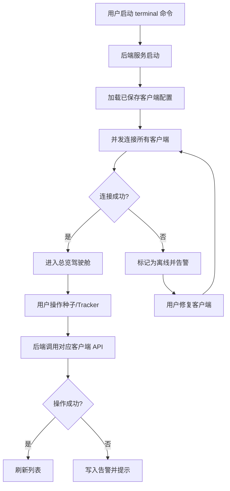

# TorrentHub - 多客户端种子统一管理平台 PRD

## 1. 产品概述

TorrentHub 是一款面向 PT/BT 玩家与自建 NAS 用户的网页端种子统一管理平台，聚合 qBittorrent 与 Transmission 两类主流客户端，通过一个界面完成多实例的种子增删、Tracker 修改、健康监测与全 API 操作，并支持通过 terminal 命令一键拉起本地服务。

- 目标用户：拥有多个 qBittorrent / Transmission 实例的进阶下载用户、NAS 玩家、PT 站点维护者
- 核心价值：消除多客户端来回切换的痛点，提供故障自愈与批量 Tracker 修改能力，降低运维心智负担

## 2. 核心功能

### 2.1 用户角色

| 角色 | 接入方式 | 核心权限 |
|------|----------|----------|
| 管理员 | 本地启动后默认登录 | 管理所有客户端实例、执行全部 API 操作 |
| 访客（可选） | Token 共享 | 只读查看种子列表与统计 |

### 2.2 功能模块

1. **总览驾驶舱（Dashboard）**：跨客户端聚合统计、健康状态卡片、实时活动流
2. **客户端管理（Clients）**：添加/编辑/删除 qBittorrent & Transmission 实例，连接测试
3. **种子中心（Torrents）**：跨客户端统一种子列表、批量增删、分类筛选、详情抽屉
4. **添加种子（Add Torrent）**：磁力链接 / Torrent 文件 / URL，支持多客户端分发
5. **Tracker 工作台（Trackers）**：批量增删改 Tracker、Tracker 健康度、跨种子替换
6. **故障监测（Monitor）**：连接异常、磁盘告警、死种检测、Tracker 失效、自动重试
7. **设置（Settings）**：服务端口、认证、主题、API Token、日志查看

### 2.3 页面详情

| 页面名称 | 模块名称 | 功能描述 |
|----------|----------|----------|
| 总览驾驶舱 | 聚合统计卡 | 总种子数、活跃数、下载/上传速率、磁盘占用按客户端分色展示 |
| 总览驾驶舱 | 健康状态环 | 每个客户端一环形进度，颜色映射健康度（绿/黄/红） |
| 总览驾驶舱 | 实时活动流 | 最近 50 条种子状态变更事件，自动滚动 |
| 客户端管理 | 实例列表卡片 | 名称、类型徽标、URL、状态徽标、版本号、磁盘用量条 |
| 客户端管理 | 添加/编辑表单 | 类型选择、URL、用户名、密码、连接测试按钮 |
| 种子中心 | 统一种子表格 | 列：名称、客户端、大小、进度、速率、状态、Tracker 数、操作 |
| 种子中心 | 批量操作工具栏 | 全选、删除、暂停、恢复、修改 Tracker、迁移客户端 |
| 种子中心 | 详情抽屉 | 文件列表、Peer 列表、Tracker 列表、速率曲线图 |
| 添加种子 | 分发配置 | 源（磁链/文件/URL）、目标客户端多选、保存路径、参数开关 |
| Tracker 工作台 | Tracker 列表 | 跨种子聚合、每个 Tracker 的种子数、成功率、平均响应 |
| Tracker 工作台 | 批量编辑器 | 选择种子集合 → 增加/替换/删除 Tracker，支持正则替换 |
| 故障监测 | 告警时间线 | 时间、级别、客户端、事件、详情、操作按钮（重试/忽略） |
| 故障监测 | 规则配置 | 死种阈值、Tracker 失效判定、磁盘水位、自动重试策略 |
| 设置 | 服务配置 | 端口、监听地址、访问 Token、CORS 白名单 |
| 设置 | 主题切换 | 暗色/亮色/跟随系统 |
| 设置 | 日志查看 | 实时滚动日志、级别过滤、导出 |

## 3. 核心流程

**主流程 1 - 添加客户端并验证**：用户进入客户端管理 → 点击"添加客户端" → 选择类型（qBittorrent / Transmission）→ 填写 URL、账号密码 → 点击"连接测试" → 后端尝试登录并获取版本信息 → 成功后保存到实例列表 → 总览驾驶舱出现新卡片。

**主流程 2 - 跨客户端添加种子**：用户点击"添加种子" → 选择源（磁链/文件/URL）→ 多选目标客户端 → 自动获取各客户端的保存路径 → 设置参数（暂停/开始、限速）→ 提交 → 后端并发向各客户端下发 → 实时反馈每个客户端的成功/失败。

**主流程 3 - 批量 Tracker 修改**：在 Tracker 工作台选中目标 Tracker → 选择"批量替换" → 输入新旧 Tracker URL（支持正则）→ 预览影响种子列表 → 确认执行 → 后端调用各客户端 Tracker 修改 API → 返回结果汇总。

**主流程 4 - 故障自愈**：监测轮询发现客户端连接失败 → 触发重试策略（指数退避）→ 仍失败则写入告警时间线 → 推送通知（可选 Webhook）→ 用户在告警面板处理。

## 4. 用户界面设计

### 4.1 设计风格

- **美学方向**：精密工业仪表盘（Refined Industrial Dashboard）— 暗色为主，借鉴示波器/数控面板的硬朗感，配以霓虹绿与琥珀色作为状态强调
- **主色**：深炭黑 `#0A0E0F` 背景，钢灰 `#1A1F22` 卡片，霓虹绿 `#00E676` 主强调（活跃/健康），琥珀 `#FFB300` 警告，朱红 `#FF3D00` 错误
- **次色**：青蓝 `#00B8D4`（Transmission 品牌）、紫罗兰 `#7C4DFF`（qBittorrent 品牌）作为客户端类型徽标
- **字体**：标题 `Space Grotesk`（几何感强），数据/代码 `JetBrains Mono`，正文 `IBM Plex Sans`
- **按钮风格**：扁平 + 1px 边框 + 微发光，主操作按钮带霓虹绿边框
- **布局**：左侧固定导航栏（72px 图标式）+ 顶部状态条 + 主内容区网格化
- **图标**：Lucide 图标库，线性风格，1.5px 描边

### 4.2 页面设计概览

| 页面名称 | 模块名称 | UI 元素 |
|----------|----------|----------|
| 总览驾驶舱 | 聚合统计卡 | 4 列网格，大号数字 + 趋势小图，霓虹绿描边 |
| 总览驾驶舱 | 健康状态环 | SVG 环形进度，每客户端一个，悬停展开详情 |
| 总览驾驶舱 | 活动流 | 左侧时间轴 + 事件卡片，自动滚动 + 暂停按钮 |
| 客户端管理 | 实例卡片网格 | 3 列卡片，顶部类型色条，状态徽标呼吸动画 |
| 种子中心 | 数据表格 | 紧凑行高，斑马纹，行内进度条，悬停高亮 |
| 种子中心 | 详情抽屉 | 右侧 480px 抽屉，Tab 切换文件/Peer/Tracker |
| 添加种子 | 步骤表单 | 3 步进度条，目标客户端卡片多选 |
| Tracker 工作台 | 双栏布局 | 左 Tracker 列表 + 右影响种子预览 |
| 故障监测 | 时间线 | 左侧级别色条 + 卡片堆叠，可折叠详情 |
| 设置 | 分组表单 | 左侧锚点导航 + 右侧表单组 |

### 4.3 响应式

- 桌面优先（≥1280px 完整三栏布局）
- 平板（768-1279px）侧边栏折叠为图标，主内容双栏
- 移动端（<768px）单栏堆叠，表格转卡片列表，触摸优化按钮尺寸 ≥44px

### 4.4 动效

- 页面加载：左侧导航滑入 + 主内容 staggered fade-up（错峰 80ms）
- 数据更新：数字滚动动画（odometer 风格），进度条平滑过渡
- 状态变更：客户端离线时卡片红色脉冲边框，告警出现时顶部横幅滑入
- 悬停：表格行 1px 左侧霓虹绿指示线滑入
