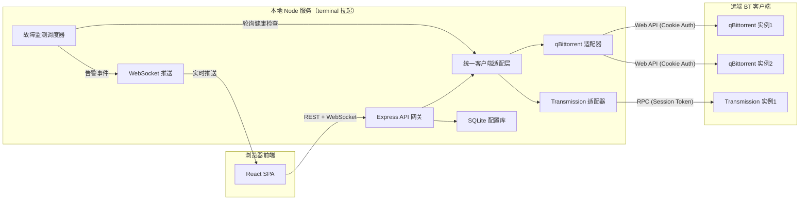
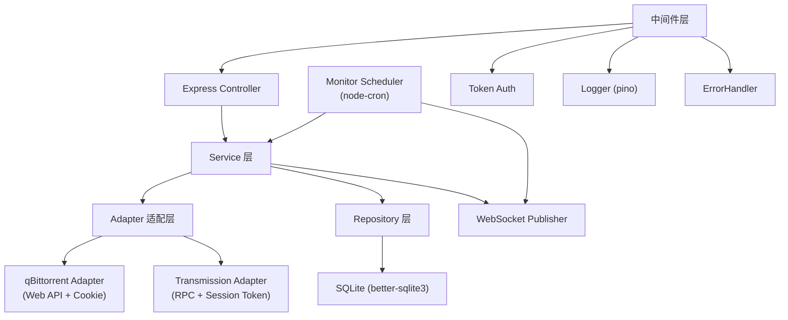
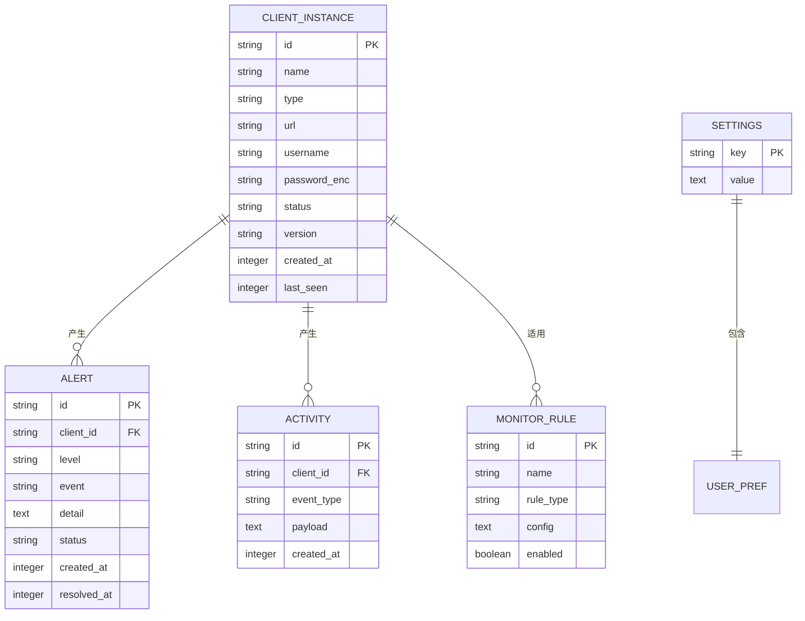

# TorrentHub - 技术架构文档

## 1. 架构设计



## 2. 技术说明

- **前端**：React@18 + tailwindcss@3 + vite@5 + react-router@6 + TanStack Query@5 + zustand@4（状态管理）+ recharts（图表）+ lucide-react（图标）+ motion（动效）
- **初始化工具**：`npm create vite@latest torrenthub -- --template react-ts`
- **后端**：Node.js@20 + Express@4 + ws@8（WebSocket）+ better-sqlite3（配置存储）+ node-fetch（HTTP 客户端调用）+ multer（torrent 文件上传）
- **数据存储**：SQLite（`~/.torrenthub/config.db`），存储客户端实例配置、告警记录、用户偏好；不存储种子数据（实时拉取）
- **认证**：本地服务默认无认证；如绑定非 localhost 则启用 Token（Bearer）认证
- **CLI 启动**：提供 `torrenthub` 全局命令（`bin/torrenthub.js`），执行后启动 Express 服务并自动打开浏览器

## 3. 路由定义

### 3.1 前端路由

| 路由 | 用途 |
|------|------|
| `/` | 重定向到 `/dashboard` |
| `/dashboard` | 总览驾驶舱 |
| `/clients` | 客户端实例管理 |
| `/torrents` | 种子中心列表 |
| `/torrents/add` | 添加种子分发 |
| `/torrents/:clientId/:hash` | 种子详情抽屉（query 参数控制） |
| `/trackers` | Tracker 工作台 |
| `/monitor` | 故障监测告警 |
| `/settings` | 设置 |

### 3.2 后端 REST API

| 方法 | 路由 | 用途 |
|------|------|------|
| GET | `/api/health` | 服务健康自检 |
| GET | `/api/clients` | 列出所有客户端实例 |
| POST | `/api/clients` | 添加客户端实例 |
| PUT | `/api/clients/:id` | 更新客户端实例 |
| DELETE | `/api/clients/:id` | 删除客户端实例 |
| POST | `/api/clients/test` | 测试客户端连接 |
| GET | `/api/clients/:id/version` | 获取客户端版本与能力 |
| GET | `/api/torrents` | 跨客户端聚合种子列表（支持 filter/sort/page） |
| GET | `/api/torrents?clientId=:id` | 单客户端种子列表 |
| POST | `/api/torrents` | 添加种子（磁链/文件/URL，多客户端分发） |
| DELETE | `/api/torrents` | 批量删除种子 |
| PATCH | `/api/torrents/state` | 批量暂停/恢复 |
| GET | `/api/torrents/:clientId/:hash` | 种子详情（文件/peer/tracker/属性） |
| POST | `/api/torrents/:clientId/:hash/files/priority` | 设置文件优先级 |
| POST | `/api/torrents/:clientId/:hash/trackers` | 增加单个种子 Tracker |
| PUT | `/api/torrents/:clientId/:hash/trackers` | 替换种子 Tracker |
| DELETE | `/api/torrents/:clientId/:hash/trackers` | 删除种子 Tracker |
| POST | `/api/trackers/batch` | 批量 Tracker 操作（增/改/删，支持正则） |
| GET | `/api/trackers` | 跨客户端 Tracker 聚合统计 |
| GET | `/api/monitor/alerts` | 告警列表 |
| PATCH | `/api/monitor/alerts/:id` | 处理告警（确认/忽略） |
| GET | `/api/monitor/rules` | 监测规则查询 |
| PUT | `/api/monitor/rules` | 监测规则更新 |
| GET | `/api/settings` | 服务设置 |
| PUT | `/api/settings` | 更新设置 |
| GET | `/api/logs` | 日志流（SSE） |
| WS | `/ws` | WebSocket：实时种子状态、告警、活动流 |

### 3.3 透传 API（全 API 能力）

为支持"全部 API"，提供透传端点，直接映射到原客户端 API，避免适配层遗漏能力：

| 方法 | 路由 | 用途 |
|------|------|------|
| ANY | `/api/proxy/:clientId/qbittorrent/*` | 透传 qBittorrent Web API |
| POST | `/api/proxy/:clientId/transmission` | 透传 Transmission RPC（body 为 method/arguments） |

## 4. API 定义

### 4.1 统一客户端类型

```typescript
type ClientType = 'qbittorrent' | 'transmission';

interface ClientInstance {
  id: string;
  name: string;
  type: ClientType;
  url: string;           // 如 http://192.168.1.10:8080
  username: string;
  password: string;      // 加密存储
  status: 'online' | 'offline' | 'degraded';
  version?: string;
  createdAt: number;
  lastSeen?: number;
}
```

### 4.2 统一种子模型

```typescript
interface UnifiedTorrent {
  clientId: string;
  hash: string;
  name: string;
  size: number;
  progress: number;       // 0-1
  status: 'downloading' | 'seeding' | 'paused' | 'queued' | 'error' | 'checking' | 'stalled';
  downloadSpeed: number;
  uploadSpeed: number;
  eta: number;
  ratio: number;
  savePath: string;
  trackers: string[];
  files: TorrentFile[];
  peers: PeerInfo[];
  addedOn: number;
  category?: string;
  tags?: string[];
  raw?: unknown;          // 原始客户端对象，用于透传
}
```

### 4.3 添加种子请求

```typescript
interface AddTorrentRequest {
  source:
    | { type: 'magnet'; value: string }
    | { type: 'url'; value: string }
    | { type: 'file'; filename: string; base64: string };
  clientIds: string[];     // 多客户端分发
  savePath?: string;
  paused?: boolean;
  limit?: { downloadLimit?: number; uploadLimit?: number };
  category?: string;
  tags?: string[];
}
```

### 4.4 批量 Tracker 操作

```typescript
interface BatchTrackerRequest {
  torrentKeys: { clientId: string; hash: string }[];
  operation: 'add' | 'replace' | 'remove';
  urls: string[];          // add: 新增；remove: 待删
  replace?: { from: string; to: string };  // replace：支持正则
  previewOnly?: boolean;   // true 时只返回影响预览，不执行
}
```

### 4.5 WebSocket 消息

```typescript
type WSMessage =
  | { type: 'torrent:update'; payload: Partial<UnifiedTorrent> & { clientId: string; hash: string } }
  | { type: 'alert:new'; payload: Alert }
  | { type: 'client:status'; payload: { clientId: string; status: string } }
  | { type: 'activity'; payload: ActivityEvent };
```

## 5. 服务端架构图



### 5.1 适配层设计

适配层是核心抽象，确保两种客户端 API 行为统一：

```
ClientAdapter (interface)
├── login(): Promise<void>
├── getVersion(): Promise<string>
├── getTorrents(filter): Promise<UnifiedTorrent[]>
├── getTorrentDetails(hash): Promise<TorrentDetails>
├── addTorrent(source, opts): Promise<void>
├── deleteTorrents(hashes, deleteFiles): Promise<void>
├── pauseTorrents(hashes) / resumeTorrents(hashes)
├── setFilePriority(hash, fileIndices, priority)
├── addTracker(hash, urls) / removeTracker(hash, urls)
├── replaceTracker(hash, oldUrl, newUrl)
├── getTrackers(): Promise<TrackerStats[]>
├── getFreeSpace(): Promise<number>
└── raw(path, opts): Promise<Response>   // 透传
```

- `QbittorrentAdapter` 实现：基于 Web API，登录后保存 Cookie，所有请求带 Cookie
- `TransmissionAdapter` 实现：基于 RPC，使用 `X-Transmission-Session-Id` 头处理 409 重试

## 6. 数据模型

### 6.1 ER 图



### 6.2 数据定义语言（SQLite DDL）

```sql
CREATE TABLE IF NOT EXISTS client_instance (
  id TEXT PRIMARY KEY,
  name TEXT NOT NULL,
  type TEXT NOT NULL CHECK(type IN ('qbittorrent','transmission')),
  url TEXT NOT NULL,
  username TEXT NOT NULL,
  password_enc TEXT NOT NULL,
  status TEXT DEFAULT 'offline',
  version TEXT,
  created_at INTEGER NOT NULL,
  last_seen INTEGER
);

CREATE TABLE IF NOT EXISTS alert (
  id TEXT PRIMARY KEY,
  client_id TEXT NOT NULL,
  level TEXT NOT NULL CHECK(level IN ('info','warning','error','critical')),
  event TEXT NOT NULL,
  detail TEXT,
  status TEXT DEFAULT 'open',
  created_at INTEGER NOT NULL,
  resolved_at INTEGER,
  FOREIGN KEY(client_id) REFERENCES client_instance(id) ON DELETE CASCADE
);
CREATE INDEX IF NOT EXISTS idx_alert_status ON alert(status);
CREATE INDEX IF NOT EXISTS idx_alert_created ON alert(created_at DESC);

CREATE TABLE IF NOT EXISTS activity (
  id TEXT PRIMARY KEY,
  client_id TEXT NOT NULL,
  event_type TEXT NOT NULL,
  payload TEXT,
  created_at INTEGER NOT NULL,
  FOREIGN KEY(client_id) REFERENCES client_instance(id) ON DELETE CASCADE
);
CREATE INDEX IF NOT EXISTS idx_activity_created ON activity(created_at DESC);

CREATE TABLE IF NOT EXISTS monitor_rule (
  id TEXT PRIMARY KEY,
  name TEXT NOT NULL,
  rule_type TEXT NOT NULL,
  config TEXT NOT NULL,
  enabled INTEGER DEFAULT 1
);

CREATE TABLE IF NOT EXISTS settings (
  key TEXT PRIMARY KEY,
  value TEXT
);

-- 默认监测规则
INSERT OR IGNORE INTO monitor_rule (id, name, rule_type, config, enabled) VALUES
('dead-seed', '死种检测', 'dead_seed', '{"noPeerHours":24,"noProgressHours":12}', 1),
('tracker-dead', 'Tracker 失效', 'tracker_dead', '{"failThreshold":3,"intervalMin":15}', 1),
('disk-water', '磁盘水位', 'disk_water', '{"warnPercent":85,"criticalPercent":95}', 1),
('client-reconnect', '客户端断连重试', 'client_reconnect', '{"maxRetry":5,"backoffBaseSec":2}', 1);

INSERT OR IGNORE INTO settings (key, value) VALUES
('port', '7878'),
('host', '127.0.0.1'),
('authEnabled', 'false'),
('authToken', ''),
('theme', 'dark'),
('openBrowserOnStart', 'true');
```

## 7. Terminal 启动设计

### 7.1 命令行入口

项目根目录 `bin/torrenthub.js`：

```javascript
#!/usr/bin/env node
import { startServer } from '../dist/server.js';
import open from 'open';

const args = parseArgs(process.argv.slice(2));
// torrenthub                  → 默认 127.0.0.1:7878，自动开浏览器
// torrenthub --port 8080      → 指定端口
// torrenthub --no-browser     → 不自动打开浏览器
// torrenthub --host 0.0.0.0   → 监听所有地址（强制启用 Token 认证）
startServer(args).then(({ port, host }) => {
  if (args.browser !== false) open(`http://127.0.0.1:${port}`);
});
```

### 7.2 启动流程

1. 解析命令行参数（端口、主机、是否开浏览器）
2. 加载/初始化 SQLite 配置（首次运行写入默认规则与设置）
3. 启动 Express + WebSocket 服务
4. 并发连接所有已保存客户端，初始化适配器
5. 启动 Monitor Scheduler（node-cron，默认每 15s 健康轮询）
6. 如 `--no-browser` 未指定，调用 `open` 拉起默认浏览器
7. 输出本地访问 URL 与日志

### 7.3 安装与使用

```bash
# 全局安装（推荐）
npm install -g torrenthub
torrenthub                    # 默认启动
torrenthub --port 9000        # 指定端口

# 本地开发
git clone <repo> && cd torrenthub
npm install
npm run dev                   # 同时启动前端 vite 与后端，代理打通
```

## 8. 关键技术约束

- **安全**：密码字段 AES-256 加密存储；监听非 localhost 时强制启用 Token；CORS 仅允许配置白名单
- **性能**：种子列表轮询默认 5s，可配置；WebSocket 仅推送 diff；SQLite 单表超过 10 万条时自动归档
- **错误处理**：适配层捕获原客户端错误，统一转为 `{ code, message, raw }` 格式；连接失败自动降级为 offline
- **日志**：pino 结构化日志，按日切割，保留 7 天
- **可观测**：`/api/health` 暴露服务自身与各客户端健康状态，供外部监控接入
